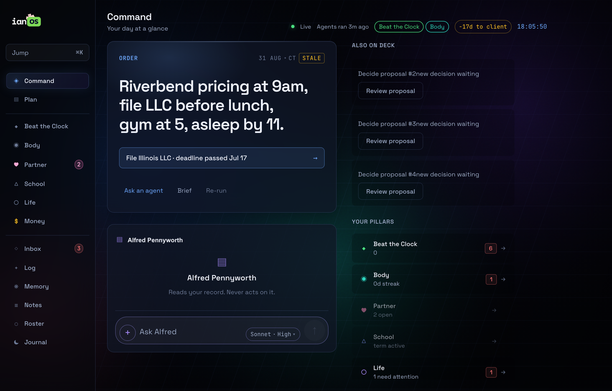
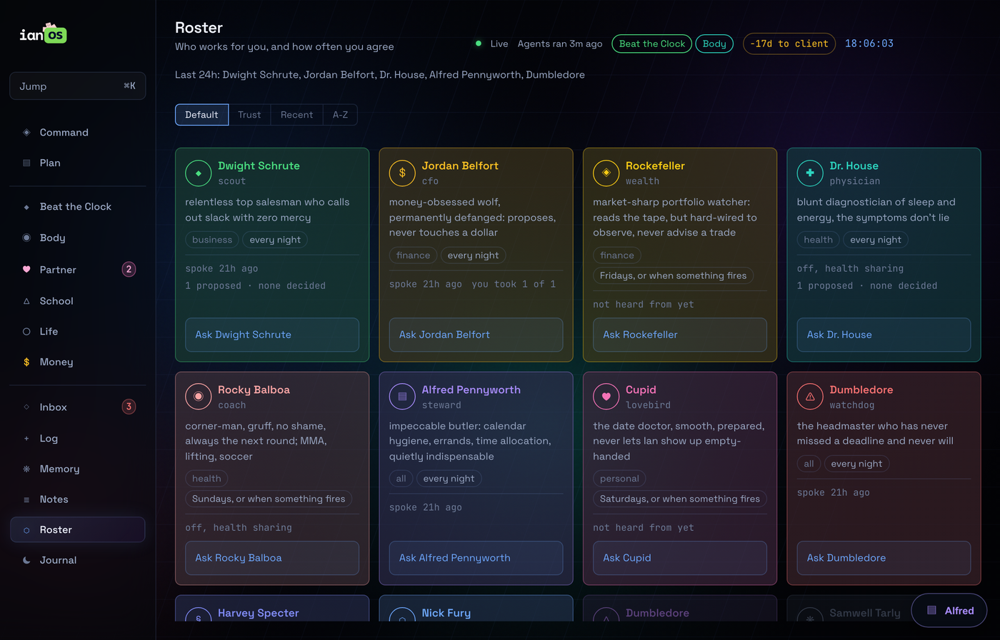
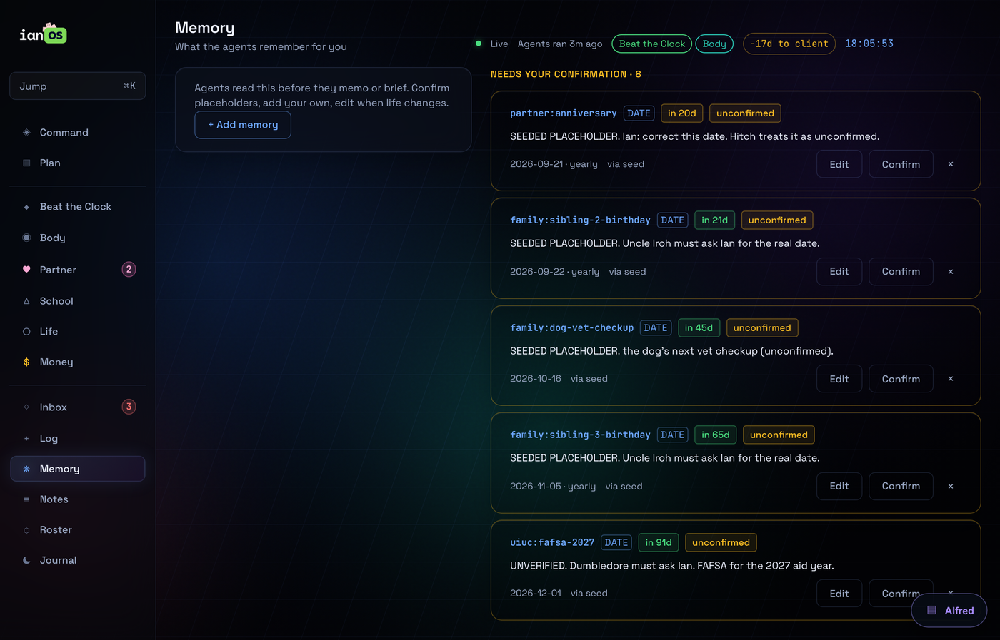
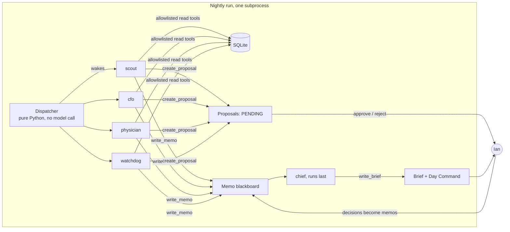

# ianOS

A local-first personal operating system run by a roster of AI agents that read, memo and propose, and never act without a human approval.

One SQLite file. One nightly agent run. One dashboard built for a two-minute visit. It runs my actual life (a company, a degree, training, money, a relationship), which is why the interesting engineering is in the guardrails, not the prompts.

> This is a scrubbed public mirror of a private repo: fresh history, demo data, a sample dossier, no credentials. What was changed and why is in [docs/PUBLIC-MIRROR.md](docs/PUBLIC-MIRROR.md).

## What it does

Every night a dispatcher decides which agents wake. Each agent reads only the tables its role is allowed to read, posts memos to a shared blackboard, and files proposals. The chief runs last, cuts the night's memos to a hard budget of five items, and writes one imperative sentence for tomorrow: the Day Command. In the morning the dashboard shows that sentence, the brief, and the proposals waiting for a decision.

Agents have three verbs: READ, MEMO, PROPOSE. A proposal sits PENDING until a person approves or rejects it, and approval is inert: it records a decision, it never sends, spends or deletes anything.

Around that core sits a full product: six life pillars, a day plan with two-way iCloud sync, a deterministic cold-call queue with a self-writing script, a private journal no agent can read, class notes with consent-gated study aids, and an agent chat that is a separate read-only boundary.

## What it looks like

Demo data, seeded by `make setup`.

| Command home: the Day Command, pending decisions, the pillars | The roster: cadence and track record per agent |
|---|---|
|  |  |



## The agent architecture



### Roles are data, the runner is code

There is one runner ([agents/runner.py](agents/runner.py)) and 15 role files ([agents/roles/](agents/roles/)). A role is markdown with frontmatter: id, codename, tier, day, domains. The id is a foreign key into every memo, proposal and fact the role ever wrote, so it never changes; the codename is display only. Adding an agent is three edits: a role file, a tool allowlist, an entry in the sequence.

### Guardrails are code, not prompts

- Agents get zero built-in tools. The only tools that exist are 43 functions on an in-process MCP server, and each role has a hard-coded allowlist. Everything else is explicitly disallowed.
- Only the CFO can file a money proposal. The check lives inside `create_proposal`, not in a prompt. The wealth agent cannot propose a trade: a regex over its output rejects the verbs.
- Only the chief writes briefs or the weekly focus.
- Every number must trace to a table row. Read tools return raw rows plus code-computed aggregates, and the date math is done in Python before the model sees it.
- A role crash becomes a memo from `system` and the sequence continues. One agent failing never aborts the night.
- Briefs are unique per day and kind, so re-running a night replaces rather than duplicates. Duplicate and near-duplicate proposals collapse, and abandoned ones expire before they can wake anyone.
- Proposal attachments are inert: closed, versioned plain-text shapes, server-resolved evidence references, never a send.

### The dispatcher: determinism for detection, a model only for narration

`should_run()` decides run or skip for each role in pure Python. Daily roles always run. Weekly roles run on their day or when a tripwire fires: a dated fact inside 14 days, no workout in 3 days, a document pending review. A skipped agent costs nothing, and `make plan` prints tonight's slate for free. The chief only composes a brief if the night actually produced something.

### Memory that respects domain walls

Durable facts live in a namespaced table (`partner:*`, `uiuc:*`, `family:*`, `market:*`). `read_facts` is scoped in code to the calling role's own domains, so an agent cannot ask for another domain's memory. Facts that arrive from connectors are born unverified and stay that way until confirmed on the Memory page. One role, the archivist, may write across namespaces, and it distills a week of memos into facts.

### Interactive agents are a second, read-only boundary

Chat and Ask reuse the roles but not the nightly writer instructions. An interactive agent's tools are its normal allowlist intersected with a read-only set. Runner state is ContextVar-backed so one invocation cannot inherit another's role or evidence, and a shared execution gate stops a chat turn from colliding with the nightly run. Chat writes no memos, facts, briefs or focus. Anti-slop is enforced in code (em dashes are rewritten on every reply), not requested in prose.

### Privacy walls, each with a sentinel test

The journal never reaches an agent: no tool exists for it, `/api/state` excludes it, and the physician gets one line ("closed the day 5 of 7"). A website form's consent column never enters a memo or a push. Push notifications carry a name and a time only. Each wall has a test that fails if it is weakened.

### Cost

Haiku for every nightly role, Sonnet for the weekly deep brief. The dispatcher's free skips are what keep the target under five dollars a month.

## How it was built

The code was written by directing coding agents (Claude Code) against written specs, and the repo is organised so that an agent can work in it safely:

- **Specs first.** 33 numbered specs in [docs/](docs/) plus two root specs. Each carries a defect ledger and an "as built" section, so the next session starts from what shipped, not from what was planned. Some specs exist because an earlier one was wrong: [SPEC-v26](docs/SPEC-v26-agent-chat.md) reverses [SPEC-v25](docs/SPEC-v25-day-chat.md) and says why.
- **[CLAUDE.md](CLAUDE.md) is the operating manual for the coding agent**: the load-bearing ideas, the write boundaries, and the traps that have actually shipped here.
- **Project skills** ([.claude/skills/](.claude/skills/)) hold the binding law for the two areas where a wrong move is expensive: interface work (`osui`) and the data layer (`data`). The agent invokes the skill before touching either.
- **Slash commands with read-only pledges** ([.claude/commands/](.claude/commands/)) let a Claude session with Gmail, Calendar or Drive connectors read and emit strict JSON that one loader validates. The commands never send, label or delete.
- **Audit passes.** Three systematic audit-then-fix passes over the UI ([SPEC-v13](docs/SPEC-v13-impeccable-mobile.md), [v14](docs/SPEC-v14-impeccable-web.md), [v28](docs/SPEC-v28-transformation.md)), each fanning out audit agents per dimension and verifying every finding against source and a live browser.
- **Tests as law.** 982 Python tests across 64 files, plus a Node suite for the dashboard. The house rule is that a guardrail that cannot fail proves nothing: [tests/test_role_files.py](tests/test_role_files.py) first proves its scanner catches a synthetic violation, then runs it against the real prompts.

## Run it on demo data

```bash
make setup     # venv, pip, npm install, seed demo data
make dev       # API on :8787 + dashboard on :5173
make plan      # who the dispatcher would wake tonight, no model calls
make test      # pytest
```

The lock-screen password for this mirror is `ianos`; change `PASS_HASH` in [dashboard/src/lib/lock.js](dashboard/src/lib/lock.js) before installing it anywhere. Agent runs need `ANTHROPIC_API_KEY` or a Claude Code OAuth token in `.env`; see [.env.example](.env.example).

## Repo map

| Path | What lives there |
|---|---|
| `agents/` | the runner, the MCP tool server, 15 role files, the sample dossier |
| `core/` | SQLite schema and queries, metrics, streaks, plan, journal, leads, school |
| `api/` | FastAPI localhost API; `/api/state` is the one fat endpoint the dashboard polls |
| `dashboard/` | Vite + React PWA, authored mobile first |
| `ingest/` | loaders: the only writers for bank, brokerage, calendar, Canvas and website data |
| `tests/` | pytest suite, including the privacy-wall sentinels |
| `docs/` | specs, the operator manual, phone and backup runbooks |
| `.claude/` | skills and slash commands for the coding agent |

## Read next

- [docs/MANUAL.md](docs/MANUAL.md): the operator manual, every page and every make target.
- [CLAUDE.md](CLAUDE.md): the architecture as the coding agent sees it.
- [docs/SPEC-v2-dispatcher-deck.md](docs/SPEC-v2-dispatcher-deck.md): where the roster and the dispatcher came from.
- [docs/SPEC-v23-interactive-agents.md](docs/SPEC-v23-interactive-agents.md) and [docs/SPEC-v26-agent-chat.md](docs/SPEC-v26-agent-chat.md): the read-only interactive boundary.
- [docs/SPEC-v9-the-line.md](docs/SPEC-v9-the-line.md): a deterministic queue and a call script that writes itself without a model in the loop.

MIT licensed. Built by Ian McCallum.
