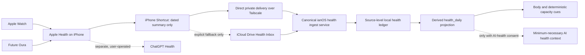

# SPEC v35: The Health Data Loop

**Status:** PROPOSED. No implementation is authorized by this document alone.

**Date:** 2026-08-26\\
**Owner:** Ian\\
**Audience:** Ian and the implementing agent\\
**Decision:** Apple Health is the sensor ledger, ianOS is the private decision
engine, and ChatGPT Health is an optional separate conversational analyst.

## 0. Executive decision

ianOS should not try to import data out of ChatGPT Health. There is no
documented public export or write-back path from ChatGPT Health to ianOS, and
ChatGPT Health is deliberately a separate product boundary. It is useful as a
place to ask personal questions about connected Apple Health data, but not as
ianOS's database or sync layer.

The v1 architecture is:

1. Apple Watch records sleep, steps, and workouts into Apple Health.
2. An iPhone Shortcut creates small, dated daily summaries.
3. ianOS ingests those summaries through a source-aware health contract.
4. ianOS keeps a local history, tells the truth about data quality, and turns
   evidence into one useful decision rather than a score.
5. ChatGPT Health remains optional and user-operated. Nothing transfers
   between it and ianOS automatically.

This explicitly replaces the idea that a native HealthKit app is required
now. A native app remains a later option if Shortcuts fail the reliability
gate in §18. It does not mean Apple Health itself costs $99 per year: an Apple
account permits personal device testing for free; the $99/year Apple Developer
Program is for durable distribution and advanced app capabilities.

### What this supersedes

- It supersedes only the automated sensor-capture direction in
  SPEC-v6-the-corner.md and the automatic-sleep recommendation in
  docs/SHORTCUTS.md. Manual one-tap Gym, Sleep, and Note Shortcuts remain
  supported.
- It defers the native-first capture choice in SPEC-IPHONE.md. Its HealthKit
  architecture remains useful future reference, not current implementation
  scope.
- It does not alter the weekly rest-day rules in SPEC-v34, the Garden's
  zero-shame visual language, or the existing PWA manual-capture queue except
  where this spec explicitly changes their health-data semantics.

## 1. Product outcome

Within ten seconds on the Body surface, Ian should be able to answer:

1. Did the watch capture a trustworthy health signal?
2. What is the one useful action for today, if any?
3. Is the data current, partial, queued, or unavailable?

The system should make tracking feel almost invisible:

- Apple Watch provides passive objective signals.
- Ian supplies only subjective signals that a watch cannot know, initially
  energy from 1 to 5 and optional context.
- A workout detected by a watch is an observation. A gym confirmation is a
  personal adherence choice. They must never be silently treated as the same
  event.
- A missing snapshot is missing data, never zero activity, a rest day, poor
  recovery, or a broken habit.

The v1 product is not a medical device, recovery score, diagnosis engine, or
generic wearable dashboard.

## 2. Goals, success measures, and non-goals

### Goals

| Goal | Success measure |
| --- | --- |
| Nearly frictionless capture | After setup, a normal day needs no manual sensor entry. Energy takes one tap when Ian chooses to provide it. |
| Correct health history | Replaying or revising a source snapshot never inflates workout count, minutes, steps, or sleep. |
| Honest provenance | Every visible value can say where it came from, when it was captured, and whether it is final or partial. |
| Useful personal analysis | Before a baseline exists, show facts and coverage. After a baseline, show at most one cautious, actionable pattern. |
| Privacy by structure | Raw sensor data is not sent to a remote model, generic memo, facts store, notification, or service-worker cache without explicit consent. |
| Oura-ready without rework | Oura can first flow through Apple Health; a future direct Oura source cannot double-count overlap metrics. |

### Initial success thresholds

- At least 90% of expected morning sleep snapshots arrive during a 14-day
  pilot.
- At least 95% of final daily activity snapshots arrive during that pilot, or
  the product clearly reports why a day is partial.
- Zero duplicate-workout inflation across replay, timeout, and reconnect
  tests.
- Fewer than one manual correction per week after the first two weeks.
- Median time from accepted snapshot to Body visibility is under 60 seconds
  when ianOS is reachable.
- With AI health sharing off, an audit proves that no health value reaches a
  remote model request.

### Non-goals for v1

- No native iPhone, Watch, HealthKit, CloudKit, or App Store project.
- No direct ChatGPT Health integration, scraping, export dependency, or
  embedded ChatGPT chat.
- No heart-rate variability, resting heart rate, temperature, blood oxygen,
  sleep-stage score, calories, medication, nutrition, or Oura readiness
  score.
- No universal health score, recovery score, risk color, streak penalty, or
  clinical alert.
- No automatic credit of an Apple Watch workout toward the gym streak.
- No automatic health analysis sent to a cloud model.
- No claim that the local SQLite database is encrypted by ianOS itself. The
  device's FileVault and account protections are the at-rest protection in
  this phase.

## 3. Assumptions and constraints

These assumptions keep the first implementation narrow and testable.

**Ian-specific rollout note (2026-08-27):** the ianOS Phone PWA and its private
Tailscale route are already installed and working. Do not repeat general phone
installation or Tailscale onboarding during health setup. The remaining
real-device gate is Apple Health/Shortcut validation.

- One person, one iPhone, one Apple Watch, and one ianOS installation.
- The canonical health-day timezone is a profile setting, initially
  America/Chicago. It must never be inferred from the Mac's current timezone.
- Apple Health is enabled on the iPhone. Its own source aggregation resolves
  Watch, phone, and future Oura overlap before data reaches ianOS.
- Direct delivery uses the existing private Tailscale path when the Mac is
  reachable. An iCloud Drive inbox is an explicit fallback, not a hidden
  default.
- iOS Shortcut actions and automation triggers vary by iOS release. The
  exact daily Shortcut must be validated on Ian's actual phone before it is
  presented as a reliable automated workflow.
- Existing ianOS agents use a remote model provider today. Therefore the
  existing health-agent access is not local-only and must be corrected before
  automatic health capture ships.

Travel and automatic timezone changes are deferred. v1 accepts only the
configured profile timezone; a mismatched snapshot is held for review rather
than silently assigned to the wrong day.

## 4. Current-state audit and design implications

ianOS already has valuable building blocks:

| Existing capability | v35 decision |
| --- | --- |
| health_daily daily row | Retain as a backward-compatible, derived daily projection. It is no longer the authoritative ledger. |
| POST /api/wellness | Retain for intentional manual entries, but route it through the source-aware writer. |
| POST /api/quick | Retain for tiny intentional Shortcuts only. It must never receive scheduled sensor snapshots. |
| mutation_receipts | Reuse for HTTP retry semantics. |
| ingest_log | Reuse for source freshness and safe operational status. |
| CSV importer | Retain as a legacy/backfill adapter, routed through the same writer. |
| PWA offline queue | Keep for manual entries only. Apple Shortcuts need their own retry or inbox path. |
| Body, Garden, gym streak, montage | Preserve as the health home and Training experience, with changed passive-data rules in §8. |
| Physician, Coach, and Chief health tools | Gate them behind explicit AI-health consent and isolate health insight storage. |

The present daily row has one mutable source field, so it cannot honestly
represent Apple sleep plus manual energy plus a future Oura value. Also,
the current quick endpoint applies data to the server's current day and
increments workout count on each request. It is deliberately convenient, not
safe as an automated snapshot protocol.

## 5. Principles that bind every implementation choice

1. **Sensor ledger, not sensor dashboard.** Store a small set of trustworthy
   daily facts, not every raw wearable event.
2. **Snapshots replace; they never increment.** A daily aggregate from a
   source replaces that source's earlier aggregate for the same metric and
   day. Replays are no-ops.
3. **Unknown is not zero.** An omitted or partial metric cannot erase a final
   one or become a behavioral conclusion.
4. **Provenance is per metric.** A manual energy entry must not make Apple
   sleep look manual, and an Apple refresh must not erase a manual override.
5. **One source wins per overlap metric.** ianOS may retain several sources,
   but it never adds Apple and Oura steps, sleep, or workouts together.
6. **Intent is distinct from observation.** Gym confirmation remains an
   intentional adherence event. Detected training is factual activity.
7. **Privacy is structural.** A setting alone is insufficient. Tables,
   routes, caches, agent tools, logs, and memo stores must enforce the
   boundary.
8. **No shame, no fake certainty.** Use neutral source and coverage language,
   never red failure states, and never causal claims from sparse data.
9. **One useful decision beats ten metrics.** Body owns health truth; Command
   surfaces a health item only when it changes the day.
10. **The source system stays replaceable.** Apple Health is v1's sensor
    ledger, not a permanent schema assumption.

## 6. Scope and metric dictionary

### Phase-one measurement set

| Metric key | Unit | Source in v1 | Attribution rule | Display use |
| --- | --- | --- | --- | --- |
| sleep_hours | hours | Apple Health daily summary | Credit an overnight sleep to the date it ends, in the configured health timezone. | Last night, 7-day average, capacity cue. |
| steps | count | Apple Health daily summary | Calendar day in the configured health timezone. | Historical activity and, only when partial, clearly labeled current-day progress. |
| workouts | count | Apple Health daily summary | Calendar day. | Factual training summary only. |
| workout_mins | minutes | Apple Health daily summary | Calendar day. | Factual training summary only. |
| energy | 1 through 5 | Ian manual self-report | Local date selected by Ian. | Subjective capacity and paired pattern analysis. |

The existing weight, free-text notes, manual workout type, gym confirmation,
and legacy values are preserved. They are not extended by phase one.

### Explicit meaning of final, partial, and absent

- **Final:** the source declares that the daily aggregate covers the intended
  window. A final value can replace an earlier final value from the same
  source if its capture time is newer.
- **Partial:** a value is current only through its stated as-of time. It can
  be shown as “Today at 3:10 PM,” but it cannot replace a final daily value,
  drive trends, satisfy coverage, or generate a health conclusion.
- **Absent:** the source did not send a metric. It leaves the prior value
  untouched and means unknown, not zero.
- **Zero:** valid only when the source explicitly says the full measurement
  window had zero. Zero is never invented to fill an absent field.

### Capture cadence

The initial Shortcut contract supports three deliberately distinct summaries:

1. **Sleep final:** a morning summary of sleep that ended recently, attributed
   to its wake date.
2. **Activity final:** a once-daily summary of the prior completed calendar
   day, including steps and workout totals.
3. **Activity progress:** optional manual “Sync now” data for today, clearly
   labeled with an as-of time and never used for historical analysis.

This avoids presenting an early afternoon step count as if it were a finished
day. A history backfill is allowed only during setup and is limited to the
previous 35 days.

## 7. Architecture and trust boundaries

There are two independent health paths:

- **ianOS path:** Apple Health to Shortcut to ianOS. This is the durable
  personal record and decision path.
- **ChatGPT Health path:** Apple Health to ChatGPT Health. This is optional
  conversation context and does not write to Apple Health or ianOS.

The direct path is preferable because it adds no second cloud copy. The inbox
path exists only to make a missed Mac connection recoverable, and requires
separate informed opt-in.

## 8. Canonical data model

### 8.1 Authoritative tables

| Table | Responsibility | Binding constraints |
| --- | --- | --- |
| health_sources | A configured source such as apple_health_shortcuts, manual, legacy_csv, or future oura_direct. | Source key is stable. Credentials are never stored here in clear text. |
| health_metric_source_policy | The selected primary source for each overlap metric. | Exactly one active primary source per overlap metric. |
| health_snapshots | Receipt and audit metadata for one incoming envelope. | Source key plus installation ID plus snapshot ID is unique. Store content hash and metadata, not raw request bodies. |
| health_daily_measurements | Append-only source-level metric observations and revisions. | Each row has a non-empty source record key, local day, metric, unit, observed time, received time, finality, and quality. |
| health_overrides | Explicit, reversible user corrections for an existing metric/day. | Never created implicitly by a sensor import. Includes author, reason optional, created time, and revoked time. |
| health_daily_projection_fields | Winning source and quality for each projected day and metric. | One row per local day plus metric; points to the winning measurement or active override. |
| health_daily | Existing compatibility projection used by goals, Garden, Body, and existing readers. | Values are materialized from the projection resolver. Its legacy source column is informational only. |
| health_ai_prefs | Consent state and allowed data categories for external AI use. | Default is disabled. A versioned consent timestamp is mandatory when enabled. |
| health_insights | Private, structured analysis records and user-approved experiments. | Never stored in generic memos, facts, or unrestricted blackboards. |

The exact SQL migration can use the repository's existing migration conventions,
but the table responsibilities and constraints above are required behavior.

### 8.2 Measurement fields

Every health_daily_measurements row carries:

- source_key and source_installation_id
- source_record_key, a deterministic non-empty identifier for that observation
- local_day and metric_key
- numeric value and canonical unit
- observed window start and end when the metric has a real time window
- as_of timestamp, observed_at timestamp, and received_at timestamp
- finality: partial or final
- quality: valid, partial, conflict, manual, legacy_import, or quarantined
- health snapshot reference and semantic content hash

Do not store the raw Shortcut request JSON, full Apple Health export, device
serial number, raw workout routes, or arbitrary metadata in the database.
The source-level measurement rows are enough to reproduce the daily projection
without retaining more sensitive data than needed.

### 8.3 Manual data and overrides

Manual data has three different meanings:

| Input | Storage behavior | Priority |
| --- | --- | --- |
| Energy self-report | Manual measurement, the only v1 energy source. | Primary for energy. |
| Existing manual wellness entry | Manual measurement or private note, preserving existing behavior. | Fallback unless Ian explicitly marks it as a correction. |
| “Correct this value” action | Active override with a visible source and reversible audit record. | Wins over every source until revoked. |

Sensor imports may never alter manual energy, private notes, active overrides,
or gym-confirmation events.

### 8.4 Projection resolver

For each metric and local day, resolve in this order:

1. Active user override.
2. Latest valid final measurement from the configured primary source.
3. Latest valid manual measurement when no primary-source final exists.
4. Latest valid legacy-import measurement when no better source exists.
5. Missing.

A partial measurement may be available to the live Body view as a separate
current-progress fact. It does not enter the historical daily projection until
a final observation exists.

The resolver never sums two sources. It never combines a manual workout count
with Apple Health's daily total. It never turns an absent field into zero.
Every resolver run materializes compatible values into health_daily and writes
the winner into health_daily_projection_fields.

## 9. Garden, streak, and legacy-compatibility rules

Passive sensor data would otherwise make the existing Garden appear healthy
every day merely because the Watch recorded sleep. That would turn a
zero-shame visual into a misleading one.

Therefore:

- Gym confirmation remains the only action that changes the gym streak.
- A detected Apple workout can offer “Count toward gym streak,” but only a
  deliberate confirmation creates the streak event.
- Passive sleep, steps, and workout snapshots alone must not count as a
  Garden alive day after v35 lands.
- Garden health engagement may instead use intentional actions such as a gym
  confirmation, voluntary energy check-in, or user-approved activity count.
  The exact Garden predicate must be updated and regression-tested in the
  implementation phase.
- Existing historical Garden behavior is not retroactively rewritten.

This preserves the difference between being observed and showing up for
oneself.

## 10. Snapshot ingestion contract

### 10.1 New route

Create POST /api/health/snapshots as the canonical automated-sensor writer.
POST /api/health/snapshots/progress is a deliberately narrow Shortcut adapter
for a current-day activity check: it accepts one per-run ID plus aggregate
steps, workout count, and/or workout minutes, then creates the canonical
envelope inside the server. It is not a second datastore or a generic health
write route. POST /api/quick remains an intentional one-tap route and must
reject attempts to identify themselves as automatic sensor snapshots.

The route accepts one normalized envelope with:

- schema version, initially 1
- source key: apple_health_shortcuts in phase one
- source installation ID
- stable snapshot ID
- capture kind: sleep_final, activity_final, activity_progress, or
  history_backfill
- captured-at time and configured IANA timezone
- a bounded list of normalized measurements

Each normalized measurement supplies the metric key, local day, value, unit,
source record key, observation window if relevant, as-of time, and finality.
The route accepts only the five phase-one metric keys.

The endpoint response contains only safe operational information:

- accepted, replayed, updated, or quarantined status
- the affected dates and metric names
- source freshness state
- a short non-sensitive message suitable for Shortcut display

It must not echo raw health values into generic request logs or error bodies.

#### Shortcut-progress adapter

The progress adapter exists because asking a person to build the full
provenance envelope in the iPhone editor is both error-prone and needless. It
accepts only a native Shortcuts **Current Date** run identifier and one or more
of the three current-day activity aggregates. The server supplies the paired
installation ID, configured timezone, local day, observed/as-of time, source
record key, and `activity_progress` finality before calling the canonical
writer.

- It cannot accept sleep, a historical date, a final value, a raw HealthKit
  export, or arbitrary metadata.
- Reusing the same run ID with the same aggregate is a replay; reusing it with
  a changed aggregate fails safely.
- A person-initiated later run has a new Current Date ID and writes a newer
  partial observation. It replaces no final historical value and never adds
  step samples together.

### 10.2 Validation

Reject the full envelope atomically if any required field is malformed. No
partial write is allowed.

| Field or behavior | Requirement |
| --- | --- |
| Authentication | Require a private-network request and a rotatable health-ingest capability token. Do not place credentials in URLs. |
| Payload size | Cap at 32 KB in v1. |
| Timezone | Must equal the configured health profile timezone. |
| Date range | No future final date. Current-day partial is allowed. History backfill is at most 35 local days old. |
| Sleep | Greater than 0 and at most 18 hours. |
| Steps | Integer from 0 through 150,000 when explicitly supplied. |
| Workouts | Integer from 0 through 20 when explicitly supplied. |
| Workout minutes | Integer from 0 through 1,440 when explicitly supplied. |
| Energy | Integer from 1 through 5 and accepted only from manual self-report. |
| Unknown | Omit it. Do not send null, zero, or a placeholder. |
| Source ownership | A source may write only its own source-level records. |

Values outside these bounds are quarantined with a redacted reason. They do
not become a health conclusion or silently clamp to a plausible-looking value.

### 10.3 Idempotency and revision semantics

The implementation must use both existing mutation_receipts and health-domain
receipt metadata:

1. **Transport retry:** The same snapshot ID and semantic body is replayed
   through the existing mutation-receipt behavior and returns the original
   result without a second write.
2. **Domain duplicate:** A different request ID with the identical
   source/installation/metric/day/value/as-of/finality semantic hash creates
   no additional effective measurement.
3. **Revision:** A newer capture from the same source and day appends a new
   source measurement and becomes the candidate winner. It replaces only that
   source's value for that metric and day.
4. **Conflict:** The same source record key with a different semantic body is
   quarantined rather than guessed.
5. **Removal:** An omitted metric never removes a prior value. Only a declared
   complete replacement for the same source/day/metric can supersede it.

No path increments workouts or minutes from a scheduled snapshot.

### 10.4 Transaction order

For an accepted envelope, one database transaction must:

1. Validate the envelope and calculate its semantic hash.
2. Register or replay the snapshot receipt.
3. Insert only new source-level measurements.
4. Recompute affected projection fields and compatible health_daily values.
5. Update health-source freshness through ingest_log.
6. Commit the safe response receipt.

If any step fails, no measurement, projection, or freshness state is partially
advanced.

## 11. Delivery paths

### 11.1 Direct delivery is the primary fast path

The daily Shortcut should use POST /api/health/snapshots for final summaries
and may use POST /api/health/snapshots/progress for a manual current-day
activity check through the existing Tailscale-protected ianOS route. Setup
pairs the Shortcut with a rotatable capability token scoped only to snapshot
creation for its installation ID.

The Shortcut must retry a lost response using the exact same snapshot ID. It
must not turn a timeout into a new synthetic snapshot or call /api/quick.

### 11.2 iCloud Drive Health Inbox is opt-in fallback

If Ian opts in, the Shortcut may write one immutable JSON envelope to an
iCloud Drive Health Inbox after a network failure. The filename contains a
random ID, not health values. It must never append several snapshots to one
shared note or mutable file.

The local inbox worker:

1. Scans incoming files after wake and on its normal schedule.
2. Validates them through the same canonical ingestion service used by the
   HTTP route.
3. Moves a successfully committed input to Processed only after the receipt
   is durable.
4. Moves malformed inputs to Rejected with a redacted reason and leaves
   health data unchanged.
5. Is idempotent across process restart, file reappearance, and duplicate
   direct delivery.

The inbox is not the existing iCloud CalDAV sync. It is a distinct, explicitly
configured directory and worker. It creates an additional cloud copy of
sensitive data, so setup must explain it and offer direct-only capture first.

Default retention:

- Direct delivery creates no transport-file archive.
- Inbox files remain available for recovery in Processed for 30 days, then are
  eligible for user-configured purge.
- Rejected files remain until Ian reviews or deletes them.
- ianOS must show the actual retention choice. It must not claim that deleting
  a transport file erases encrypted device backups.

### 11.3 Required real-phone validation

Before shipping Shortcut setup copy, validate on Ian's iPhone:

- The available Health actions can retrieve the intended sleep, step, and
  workout summaries.
- Permission prompts name only the intended categories.
- A morning sleep summary maps to the correct wake date.
- A retry keeps its snapshot ID.
- A direct network failure writes the fallback exactly once when fallback is
  enabled.
- A Mac-asleep scenario becomes clear status, not silent loss.

Until this is validated, the product must say “Set up capture” and “Run a test
snapshot,” not imply a completed Apple Health connection.

## 12. Read routes and freshness model

Raw sensor values must leave generic app state. /api/state receives only a
small health_status object with no metric values:

- configuration state
- selected source label
- last accepted capture timestamp
- expected capture types and their status
- 7- and 28-day coverage counts
- whether an input needs review

Body obtains actual values from authenticated, no-store routes only after it
is opened:

| Route | Purpose | Cache rule |
| --- | --- | --- |
| GET /api/health/status | Safe source state and coverage. | No-store. |
| GET /api/health/today | Last-night sleep, current activity progress if any, energy, provenance, and one deterministic capacity cue. | No-store; never put in service-worker cache. |
| GET /api/health/history?range=7 or 28 | Small trend series, coverage, and provenance summary. | No-store; never put in service-worker cache. |
| GET /api/health/insights | Private health reflections for Body, including a no-store legacy-montage compatibility view during migration. | No-store; never put in broad state or a service-worker cache. |
| POST /api/health/overrides | Create an explicit manual correction. | Mutation receipt required. |
| POST or DELETE /api/health/ai-consent | Change AI sharing consent. | Authenticated, audited, no raw payload in logs. |

The legacy wellness_today state remains temporarily for compatibility only.
The implementation must remove sensor values from broad cached state before
calling the v35 privacy model complete.

### Freshness states

Health-source freshness and app-cache freshness are separate concepts.

| State | Meaning | Exact user-facing copy |
| --- | --- | --- |
| Not configured | No capture source has been set up. | “Apple Watch capture is not set up.” |
| Awaiting first snapshot | Setup exists but ianOS has not accepted one. | “Waiting for your first health snapshot.” |
| Fresh | Expected source summary arrived in the last 30 hours. | “Apple Watch snapshot received 6:42 AM.” |
| Late | An expected summary is missing for 30 to 72 hours. | “No health snapshot received in 30h.” |
| Needs review | An input was quarantined or a source conflict exists. | “1 health snapshot needs review. Your recorded data is unchanged.” |
| Partial | A current-day value has an as-of time but no final day summary. | “Today through 3:10 PM.” |
| App cache only | The PWA cannot reach ianOS and shows cached app state. | “Showing ianOS from 2h ago. Your Mac is asleep.” |
| Local manual write queued | A PWA manual entry awaits ianOS. | “Energy saved on this phone. Sends when your Mac wakes.” |

ianOS must never say “Apple Health disconnected” unless it has direct
evidence of a revoked integration, which the Shortcut path does not provide.

## 13. Body and Command experience

### 13.1 Information architecture

Do not add a sixth mobile tab or a second health dashboard. Health truth lives
on the existing Body route. Command remains the place for today's one
decision, and only surfaces health when health changes that decision.

At a 375 by 667 viewport, the Body first fold contains:

1. Source label and freshness state.
2. Last-night sleep and the 7-day average when enough data exists.
3. One factual activity line, labeled with its actual day or as-of time.
4. Exactly one current action: set up capture, run a test, log energy, check
   capture, or count a detected workout toward the gym streak.

The existing gym streak, Garden, montage, and health goals follow as the
Training section and disclosures. This avoids replacing a calm health home
with a wall of wearable cards.

### 13.2 First visit

Use the compact empty state:

> **Start with your Apple Watch**
> Collect sleep, steps, and workouts through Apple Health Shortcuts. Energy
> stays yours.

Primary action: **Set up capture**
Secondary action: **Log today manually**

“Connect Apple Health” is prohibited copy because a PWA cannot directly
request HealthKit permission and the Shortcut path is not a live connection.

Set up capture opens the existing Sheet primitive: a mobile bottom sheet and
desktop dialog/popover. It contains only:

1. What ianOS will collect in v1.
2. Direct-only versus optional iCloud fallback choice.
3. Shortcut pairing and Health permission steps.
4. A test snapshot.
5. A received-date and data-quality confirmation.
6. A separate, optional AI-health sharing choice.

It must not dump documentation, request every Health category, or make
ChatGPT Health appear connected.

### 13.3 Normal state

The initial compact instrument follows this hierarchy:

> APPLE WATCH SNAPSHOT · 6:42 AM 
> Last night 
> 7h 42m 
> 7-day average 7h 18m 
> Today at 3:10 PM: 5,240 steps · 47m training 
> How do you feel? 1 2 3 4 5 
> Low                                      High

Rules:

- Sleep is the headline because it can reshape today.
- The activity line is one factual line, never separate score cards.
- Show “Yesterday” when only the final prior-day activity summary exists.
- Show a dash or “No data yet” for missing values, never zero.
- Energy appears only when missing. Choosing a value saves immediately and
  confirms locally, with no second Save button.
- The energy control has radio semantics, visible Low and High endpoints,
  keyboard support, and 44px targets.
- Before seven valid sleep days, show coverage such as “Building your
  baseline: 3 of 7 nights,” not a trend.

### 13.4 Health Lens

A small “Details” disclosure opens a Health Lens Sheet. It contains:

- seven- and 28-day factual trends with coverage
- source, capture time, finality, and per-metric provenance
- data-quality status and repair path
- manual correction and source-priority controls
- AI-health sharing controls
- a user-approved export or copy-summary action when that future feature is
  available

It does not become a full wearable analytics dashboard.

### 13.5 Command integration

Command does not gain a permanent sleep widget. It may show a health action
only when:

- a detected workout is awaiting deliberate streak confirmation;
- capture has been absent for three expected days;
- a local deterministic sleep cue genuinely changes today's plan; or
- energy is missing and would alter the existing day adjustment.

Use operational copy, for example “Keep demanding work after 10 AM,” rather
than a recovery label. Do not duplicate the same warning on Command and Body.

### 13.6 Accessibility, motion, and tone

- Mobile first at 375 by 667; the primary action is in the thumb zone.
- Use the shared Sheet and existing safe-area behavior.
- Fresh source state uses readable text plus a calm accent. Late and review
  states use amber/neutral treatment, never red blame language.
- Motion only communicates a real transition such as a received snapshot or
  confirmed workout. Respect reduced motion.
- No copy says failed, missed, disconnected, broke, lazy, or behind.

### 13.7 Visual direction: Signal Field

The quality bar is the clarity and calm of Apple Health and Oura, not a visual
copy of either product. ianOS keeps its own command-deck identity: near-black
space, one health-teal signal, hairline measurement rails, spare glow, and
mono numerals. The interface should feel like a trusted instrument that became
more useful when looked at, not a wearable marketing dashboard.

**Composition**

- The first fold is one continuous Signal Field rather than a grid of cards.
  A small source beacon sits above a dominant sleep reading. Its quiet
  24-hour arc shows when the sleep window occurred, not a score or a target.
- A seven-day micro-rail sits under the reading. It shows captured nights and
  the current night without percentages, trophies, rings to close, or a
  judgmental color scale.
- Steps and training live on one factual line beneath the rail. A partial
  value always carries its as-of time. A final previous-day value is labeled
  Yesterday.
- The bottom of the field holds one action. Energy is an inline five-position
  control only when it is missing. Any other action opens the existing Sheet.
- The existing Garden and gym streak begin the separate Training section. They
  never compete with the health signal for first-fold attention.

**Visual system**

| Element | Direction |
| --- | --- |
| Background | Existing near-black with a single, low-opacity teal bloom behind the live signal. No decorative starfield, glass pile, or new palette. |
| Sleep reading | Large JetBrains Mono numerals, high contrast, with small Chakra Petch labels. The number is the hero, not a card title. |
| Arc and rail | Hairline teal/neutral strokes, truthful gaps for unknown data, and a bright point only for the selected or newly received observation. |
| Status | Text plus a small beacon. Color supports the words and never carries state alone. |
| Elevation | One opaque panel surface with a fine edge. Health Lens uses the existing Sheet, not a second floating modal system. |
| Details | A Sheet with a seven- or 28-day timeline, provenance, corrections, and source controls. Desktop may widen the field, but it does not create a second dashboard. |

**Motion**

- A fresh snapshot causes the beacon to settle, the newest rail point to light,
  and the changed number to resolve in at most 320ms. It does not pulse
  forever.
- An energy selection gives immediate 200ms confirmation and a local queued
  state when ianOS is unreachable.
- Reduced motion uses static state changes and no orbit animation.

**States that must feel designed**

- Setup: the field is a quiet instrument outline with the concrete “Set up
  capture” action. It never fakes a sleep number.
- Awaiting first data: show the source beacon and the test-snapshot step.
- Fresh: sleep is primary, the source time is legible, and no extra warning
  is added.
- Partial: the activity line says exactly through what time the data applies.
- Late or review: the teal field cools to neutral/amber, preserves the last
  known fact with its age, and offers one repair action.
- Offline cache: show the global app-cache state separately from the source
  state, so an old screen is never mistaken for a stale watch.

**Implementation contract**

- Add HealthSignalPanel, SleepArc, HealthMicroRail, EnergyCheckIn, and
  HealthLensSheet as focused Body-page components or locally scoped helpers.
  They must consume real optional data and render an honest empty state when
  that data is absent.
- Reuse the existing --health pillar accent, Sheet, motion package, and
  typography. Do not introduce a new component library, an image asset, a
  progress ring, or a global redesign.
- At 375 by 667, source state, sleep value or setup state, and the one action
  must fit above the fold. Every control keeps a 44px target and safe-area
  behavior.
- Build and review the populated, setup, partial, late, queued, and
  reduced-motion variants before claiming the surface complete.

## 14. Privacy, security, and AI consent

### 14.1 Important current correction

Today, the existing read_health agent tool can serialize daily health rows to
a remote Claude model for Physician, Coach, and Chief. Physician and Coach can
then write generic memos that other roles may read. Therefore it is false to
describe current agent health behavior as local-only.

This is a hard shipping blocker: automatic Apple Health capture must not ship
until the following privacy wall is implemented and tested.

### 14.2 Data-sharing policy

| Data class | Default storage and access |
| --- | --- |
| Source-level health measurements | Local SQLite only. Excluded from broad state, generic memos, facts, notifications, logs, and unrelated agents. |
| Body daily projection | Available from dedicated no-store health routes after authenticated app access. |
| Energy context and private notes | Private by default. Not shared with agents or summaries. |
| Deterministic capacity cue | Computed locally. It may be shown in ianOS without remote AI use. |
| Remote AI health analysis | Off by default. Requires explicit, versioned, revocable consent and a minimum-necessary aggregate. |
| ChatGPT Health | Separate OpenAI product boundary. ianOS never automatically uploads to, reads from, or relies on it. |

### 14.3 Required consent design

health_ai_prefs defaults to disabled. Enabling it requires an explicit Sheet
that names:

- the remote model provider
- exact metrics and date range that may be shared
- the purpose, such as a one-time personal pattern question
- whether sharing applies only once or to a selected health role
- how to revoke it

Consent must be checked before serialization, not only before rendering a UI.
With consent off, every remote-agent request receives no health values. A
generic role sees only “Health sharing is off,” not an empty dataset it can
infer from.

Historic Physician and Coach memo/fact artifacts are treated as private health
material too: they are filtered from broad app state and every remote model
reader. The legacy memo compactor must remain unavailable to remote agents
until its database query can prove it excludes those artifacts.

A consented health-role answer is also a health boundary. It may return to Ian
on its dedicated surface, but it must never be injected into a Chief room
synthesis or a general chat-parent prompt as a specialist contribution.

With consent on:

- The health-specific reader receives a prepared aggregate: selected daily
  projection, source quality, coverage, and declared user goal.
- It never receives raw event records, device identifiers, inbox files, or
  private notes unless those are explicitly selected in the same action.
- Chief receives only a local deterministic capacity cue, if Ian permits it;
  it does not receive a health history.
- Scout, CFO, Steward, Counsel, Archivist, and unrelated chats cannot read
  health values or health-insight text.
- AI output writes only to health_insights, never generic memos or facts.
- Revoking consent immediately blocks future access. Existing remote-provider
  retention follows that provider's disclosed policy and cannot be erased by
  an ianOS toggle.

### 14.4 Operational protections

- Use Tailscale HTTPS/private routing and bearer-style capability
  authentication. Health tokens must be rotatable and scoped to snapshot
  creation.
- No secret in a URL, browser history, console output, exception text, or
  debug fixture.
- Add Cache-Control: no-store to health detail routes and prohibit the PWA
  service worker from storing their bodies.
- Redact metric values from API logs, ingest errors, analytics, telemetry,
  and dead-letter diagnostics.
- Require a device passcode and recommend FileVault in setup copy. Do not
  overstate ianOS encryption.
- Design health export and deletion as an explicit future control: export is
  local and user-initiated; deletion explains inbox copies and backup
  retention before confirmation.

## 15. Personal analysis and safety model

### 15.1 Baseline stages

| Coverage | What ianOS may show |
| --- | --- |
| 0 to 6 valid sleep days | Facts and setup/freshness only. |
| 7 to 20 valid sleep days | Seven-day average and coverage. No cross-metric pattern claim. |
| At least 21 valid paired days in the last 28 | One cautious sleep/energy or activity/energy association, with sample count and coverage. |
| At least 28 valid days with stable source quality | User-approved small personal experiments and richer trend comparison. |

All baseline calculations use valid final values and the person's own rolling
history, not universal biometric norms.

### 15.2 Pattern format

Only one pattern appears at a time:

> **Early signal** 
> Later bedtimes preceded lower next-day energy on 6 of 9 comparable days. 
> Not proof. Test a consistent wind-down for 7 days.

Every pattern must expose:

- the fact or association
- paired sample count and coverage
- uncertainty language such as “associated with,” never “caused”
- one small reversible experiment
- a dismiss or hide option

No analysis may diagnose, prescribe, tell Ian to change medication, interpret
out-of-range wearable data as an emergency, or substitute for clinical care.
If Ian has concerning symptoms, the product should encourage appropriate
professional help rather than invent a device-data conclusion.

### 15.3 Deterministic capacity cues

Existing sleep-aware planning remains useful, but it must run deterministically
on local projected data. It may suggest a lower-friction schedule after an
unusually short night. It must not mint a score, send the raw data to an
agent, or become a diagnosis.

## 16. ChatGPT Health, Oura, and native HealthKit

### ChatGPT Health

ChatGPT Health may be useful immediately for conversation:

- Connect Apple Health in the ChatGPT iPhone app if Ian wants that separate
  experience.
- Use @Health when a question should use the connected context.
- Keep its permissions, chat history, memory, and deletion controls in
  ChatGPT's Health area.

ianOS does not need that connection to work. It must not ask for an OpenAI
token, scrape a ChatGPT conversation, assume proprietary score availability,
or describe ChatGPT as a sync service. A future “Copy a seven-day ianOS
summary” action may be offered only as a user-triggered export of a selected,
minimal aggregate.

### Oura later

The default when an Oura Ring arrives is:

1. Oura writes the desired categories to Apple Health.
2. Apple Health remains the single v1 source summarized by the Shortcut.
3. ianOS does not receive Oura and Apple versions of the same steps, sleep,
   or workouts separately.

If a future direct Oura API integration is justified:

- It is opt-in and has its own source and token lifecycle.
- Setup asks which source is primary for each overlapping metric.
- Apple and Oura source records remain separate.
- Oura-only/proprietary scores stay source-specific. They do not become an
  ianOS readiness score.
- The direct integration must respect Oura account and membership
  requirements, which may change.

### Native HealthKit trigger

Do not build a native app unless a 30-day live pilot shows that the Shortcut
path cannot meet the product need, such as:

- less than 90% capture coverage despite correct configuration;
- irrecoverable missed data when the Mac sleeps;
- a required metric that cannot be summarized faithfully in Shortcuts; or
- a need for continuous raw/background capture that a daily-summary product
  deliberately does not support.

At that point, reevaluate a small Swift/HealthKit client. Personal device
testing can begin with a free Apple account; a paid Developer Program is a
distribution decision, not a prerequisite for this v35 path.

## 17. Migration and compatibility plan

1. Back up the local database before migration.
2. Introduce the source-level tables and projection resolver before changing
   any existing write path.
3. Seed existing health_daily values as legacy_import or manual measurements
   with migration-time provenance. Do not pretend their original device
   provenance is known.
4. Preserve existing manual energy, notes, weight, workout slug, and
   gym_confirmed values.
5. Route CSV import, manual wellness, and new snapshot intake through the one
   health writer.
6. Leave /api/quick behavior available for intentional shortcuts but label it
   in code and documentation as manual-only.
7. Move Body and future health routes to source-aware reads before removing
   sensor values from generic /api/state.
8. Run Garden and streak regression tests before enabling automated imports.

Rollback means disabling the source, stopping capture intake, and preserving
the existing compatibility projection. It does not delete source-level
history or manual records.

## 18. Phased implementation plan

### Phase 0: prove the capture path and privacy boundary

**Goal:** validate external facts before permanent writes.

- Verify the real iPhone Shortcut capability and the exact metrics available.
- Prototype only a test envelope; do not route automated sensor data to
  /api/quick.
- Choose direct-only versus direct plus iCloud fallback during setup.
- Audit every existing agent path that can read or write health data.
- Approve this schema, the America/Chicago health-day policy, and
  wake-date sleep attribution.

**Exit gate:** an actual test snapshot can be created, retried, and understood
by Ian; privacy work has a concrete implementation plan.

### Phase 1: private data foundation

**Goal:** make ianOS capable of telling the truth about one health fact.

- Add source, snapshot, measurement, override, projection, consent, and
  private-insight storage.
- Build the single canonical health writer and projection resolver.
- Migrate legacy health rows without erasing manual fields.
- Refactor manual wellness and CSV import through that writer.
- Replace hard-coded apple_health freshness logic with active-source status.
- Implement the AI-health privacy gate and prevent health data from entering
  generic memos, facts, and unrelated agent context.

**Exit gate:** all data/provenance/idempotency/privacy tests in §19 pass before
any physical device sync is enabled.

### Phase 2: Apple Watch capture and recovery

**Goal:** receive reliable, minimal daily summaries.

- Build the snapshot endpoint, scoped capability token, and idempotent
  response contract.
- Build the Shortcuts setup/test flow and direct delivery.
- Add the opt-in inbox worker only after direct delivery works.
- Update source freshness for accepted HTTP and inbox snapshots.
- Document repair, token rotation, and test-snapshot behavior.

**Exit gate:** a 14-day pilot meets the capture and duplicate thresholds in
§2.

### Phase 3: Body becomes health truth

**Goal:** make collected data usable without a dashboard.

- Add the first-fold Today instrument, Health Lens, provenance, coverage, and
  source states.
- Surface manual energy once, with accessible one-tap semantics.
- Move manual health fallback toward Body and remove duplicate primary
  wellness capture from Log without breaking legacy access.
- Preserve Training, gym, Garden, goals, and montage as secondary sections.
- Add Command exceptions only where they change the day.

**Exit gate:** mobile, accessibility, offline, stale, and no-data flows are
verified at 375 by 667.

### Phase 4: cautious private intelligence

**Goal:** derive helpful patterns only after trustworthy coverage exists.

- Add local baseline and coverage calculations.
- Add private health_insights, on-demand consent, and role-scoped AI context.
- Add one-pattern-at-a-time presentation and reversible experiments.
- Add local export/copy-summary selection if Ian still wants to use ChatGPT
  Health alongside ianOS.

**Exit gate:** privacy audit, sample thresholds, and non-causality tests pass.

### Phase 5: Oura and native-client decision

**Goal:** expand only if evidence justifies it.

- Use Apple Health as the Oura path first.
- Consider direct Oura only for a clear unmet metric need and an explicit
  source-priority decision.
- Reconsider native HealthKit only if the 30-day reliability gate fails.

## 19. Acceptance criteria and test matrix

### Data and ingestion

- Replaying the same Apple daily snapshot produces no new effective
  measurement and no count inflation.
- A different request ID containing the same semantic snapshot is also
  harmless.
- A newer same-source revision updates only that source/day/metric.
- A partial step snapshot cannot overwrite a final daily total.
- An omitted field cannot erase a prior value or become zero.
- An offline replay preserves the original captured local day and never uses
  the Mac's current date.
- A sleep session ending after midnight is assigned to its wake date in
  America/Chicago.
- Invalid values, future final dates, source-key conflicts, and malformed
  payloads write nothing and show a redacted review state.
- CSV imports remain idempotent and preserve existing manual fields.

### Projection and legacy behavior

- Active manual overrides win until explicitly revoked.
- Manual energy and private notes survive every Apple/Oura refresh.
- A gym confirmation never changes Apple workout totals.
- Passive Apple snapshots do not advance the gym streak or Garden by
  themselves.
- Existing metrics, goals, Body legacy reads, Coach/Physician compatibility,
  Garden, montage, and rest-day tests continue to pass with the projection.

### Privacy and security

- No raw source-level health value appears in /api/state, service-worker
  cache, generic memo feed, facts, notification payload, analytics event, or
  error log.
- With AI health sharing off, a captured remote-model request contains no
  health value or health insight text.
- With consent on, the request contains only the documented aggregate and
  selected purpose.
- Unrelated agents cannot read health rows, health insight text, or health
  private notes.
- Revoking consent blocks future health context immediately.
- Direct and inbox delivery reject unauthenticated or wrongly scoped tokens.

### UX and accessibility

- Body differentiates not configured, awaiting first snapshot, fresh, late,
  partial, review, cached app state, and queued manual write.
- No state labels a source disconnected without direct evidence.
- The 375 by 667 Body first fold shows health status, sleep or an honest empty
  state, and one reachable action.
- Energy has Low/High labels, proper radio semantics, focus state, and 44px
  targets.
- No health state uses red blame copy, a score, or an implied clinical risk.
- Reduced-motion mode has no nonessential health animation.

### Real-device end-to-end checks

- Fresh direct delivery reaches Body with correct captured date and source.
- Same-ID retry after a simulated timeout is replayed safely.
- Mac asleep plus direct-only mode gives clear late status without data loss
  claim.
- Mac asleep plus inbox opt-in recovers once the worker wakes.
- Apple Health data from Watch and future Oura does not double-count in the
  ianOS projection.

## 20. Risks and mitigations

| Risk | Mitigation |
| --- | --- |
| Shortcut capabilities differ from assumptions | Treat on-device validation as a Phase 0 gate; do not publish an untested automation recipe. |
| Mac is asleep when a Shortcut runs | Direct delivery retries safely; optional inbox preserves a single immutable envelope. |
| Source replays fabricate workouts | Daily snapshots replace source-owned values and use both transport and semantic idempotency. |
| Apple Watch and Oura overlap | Apple Health is initially the only aggregate source; future direct Oura requires source policy. |
| Passive data changes Garden semantics | Keep sensor observation separate from intentional engagement; test Garden predicate explicitly. |
| Health data leaks through agents | Consent defaults off, gate before serialization, isolate health_insights, and test every role. |
| iCloud fallback weakens privacy | Make it opt-in, visible, retained for a declared period, and avoid it for direct-only users. |
| A thin baseline produces overconfident advice | Enforce final-data coverage thresholds, sample counts, and association-only language. |
| ChatGPT Health is mistaken for an API | Name it clearly as a separate manual analyst and provide no integration control in v1. |

## 21. Decisions that require only real-world validation

The product decisions in this spec are made. These are validation tasks, not
open architecture questions:

1. Which exact iOS Shortcut actions can create the prescribed summaries on
   Ian's phone and iOS version?
2. Can the direct Tailscale route be reliably reached when the intended
   morning automation runs?
3. Does Ian prefer the privacy of direct-only capture or the extra resilience
   of opt-in iCloud inbox fallback?
4. Does Ian want any remote AI health sharing after seeing the exact
   minimum-necessary context?

Until those tests happen, ianOS can remain useful through manual wellness
capture and Apple Health export/CSV recovery without pretending it is
automatically synced.

## 22. Source notes

- [Health in ChatGPT](https://help.openai.com/en/articles/20001036-health-in-chatgpt)
  documents current Apple Health connection behavior, user permission, the
  fact that ChatGPT Health only reads connected data, and that Health is not
  supported in Codex.
- [OpenAI Health privacy and data controls](https://help.openai.com/en/articles/20001036)
  documents the Health-specific data controls and deletion timing after
  disconnecting a source.
- [Apple Developer membership comparison](https://developer.apple.com/support/compare-memberships/)
  documents free personal device testing and the $99/year distribution
  program.
- [Apple Health data sharing and export](https://support.apple.com/en-ie/guide/iphone/iph5ede58c3d/ios)
  documents app permissions and the XML export fallback.
- [Oura Apple Health integration](https://support.ouraring.com/hc/en-us/articles/360025438734-Apple-Health-Integration)
  and [the Oura API](https://support.ouraring.com/hc/en-us/articles/4415266939155-The-Oura-API)
  inform the future-Oura boundary. Their availability and membership terms
  must be rechecked when that phase begins.

## 23. Binding implementation map

This map names the existing seams to extend. It prevents v35 from becoming a
parallel health system.

| Area | Existing seam | v35 build responsibility |
| --- | --- | --- |
| Canonical storage | core/db.py and health_daily | Add source/snapshot/measurement/projection tables and helpers. Keep health_daily as the derived compatibility row. |
| Ingestion | api/main.py, mutation_receipts, ingest_log | Add the snapshot route and source-aware transaction. Leave /api/quick manual-only. |
| Legacy inputs | POST /api/wellness and ingest/import_health.py | Send both through the same health writer so manual fields keep their meaning. |
| Freshness | core/metrics.py and ingest_log | Resolve active health-source status instead of assuming an apple_health CSV import. |
| Privacy | agents/runner.py and role prompts | Gate health before remote serialization, remove generic memo/fact propagation, and store approved insight privately. |
| Primary UI | dashboard/src/pages/BodyPage.jsx | Add the Signal Field, Health Lens, setup, source status, energy check-in, and truthful empty states. |
| Shared UI | Sheet.jsx, motion, styles.css, offline.js | Reuse them. Health detail routes are no-store; only manual writes are queueable. |
| Regression safety | tests/test_quick_api.py, test_mutation_receipts.py, test_garden.py, test_montage_sleep.py, dashboard tests | Cover snapshots, source priority, agent isolation, mobile states, and unchanged Gym/Garden behavior. |

### Delivery order inside a code change

1. Tables and pure projection helpers.
2. Snapshot validation, idempotency, and safe status reads.
3. Privacy gate and tests before device data can be sent.
4. Body Signal Field against safe no-store reads, with honest fallback state.
5. Device Shortcut setup, then a real-phone pilot.

The UI must not invent data while the data layer is incomplete. Conversely, the
data layer must expose a safe, named status object before Body makes a freshness
claim.
